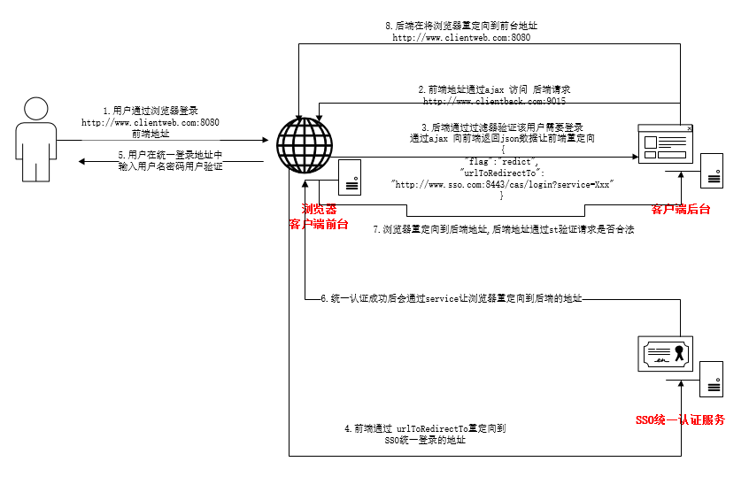
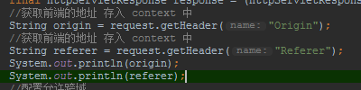
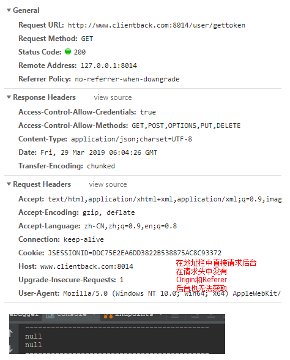
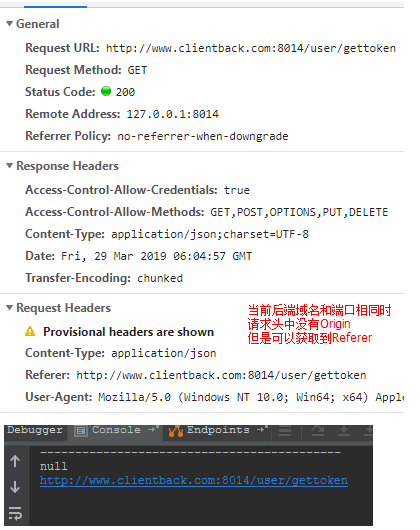
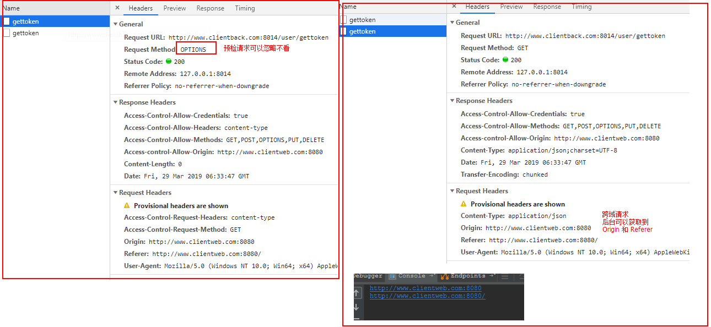

## CAS-客户端继承案例

`四个项目案例介绍`

本文着重讲解前后端分离情况下的CAS客户端案例

### 客户端集成SSO(登录)

#### 普通web项目集成SSO

#### Maven项目集成SSO

#### SpringBoot项目集成SS0

#### 前后端分离项目

##### 流程图讲解

##### 各类访问的请求头

`重点 后续过滤器中需要通过 origin 和 referer 来判断是放行还是重定向`

- 三种访问的请求头差别
- 后台打印

- 地址栏访问  

  

- ajax访问 

  

- 跨域ajax访问

  

#### 代码配置